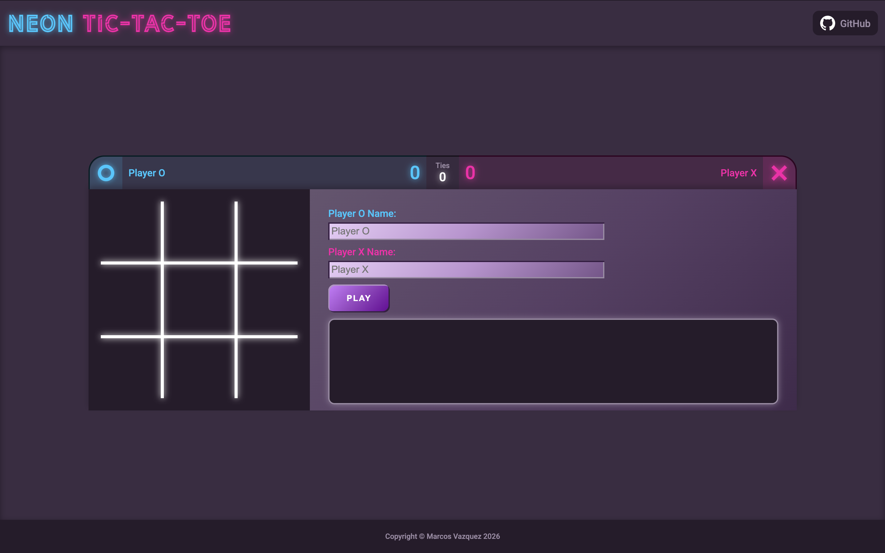
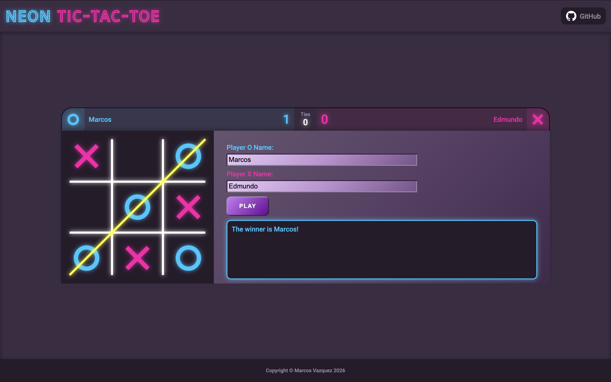

# Neon Tic-Tac-Toe

Welcome to Neon Tic-Tac-Toe! This is an interactive, browser-based version of the classic 3x3 grid game, Tic-Tac-Toe, that is neon-themed. Two players compete to connect three of their symbols in a row. This project was implemented using HTML, CSS, and JavaScript.

Rather than use constructors, I focused on utilizing factory functions, closures, and the module pattern to my JavaScript code. This helps me to manage game state through encapsulation, keeping variables like the game board grid and player information private while only exposing the necessary functions that can be used. This allows controllers for the game logic and display to interact cleanly without interfering with each other, which indicates more modular, maintainable code.

[**Live Demo**](https://github.com/marquitos150/tic-tac-toe)

## How it Works
Upon opening the page, you will not be able to interact with the 3x3 grid. This is because the game hasn't started yet. To start the game, click the "Play" button! Optionally, you can type in the input fields the players' names.

> **Note:** If a name is not provided in an input field, it will default to either "Player O" or "Player X" depending on which field was left empty.

After clicking the "Play" button, the console box below it will display text indicating which player's turn it is. Additionally, the input fields and button will be disabled for the duration of the game. To make it easier to know whose turn it is, each player's symbol color will be applied to the text and border of the console box. Now you can interact with the 3x3 grid! If you don't know how to play Tic-Tac-Toe, which is crazy if you don't, check out this [**link**](https://www.wikihow.com/Play-Tic-Tac-Toe).

Once the game is finished, the grid can no longer be played on, and the input fields and button are re-enabled. Depending on the outcome, the scoreboard will keep a tally on the number of wins for each player and ties. If you wish to play again, you would simply click the "Play" button again.

> **Warning:** After the game ends, if you or your opponent change the names in the input fields and click "Play" again, the scoreboard will reset. This ensures that new players start with a fresh score, avoids confusion between new and existing players, and prevents existing players from starting at an advantage.

